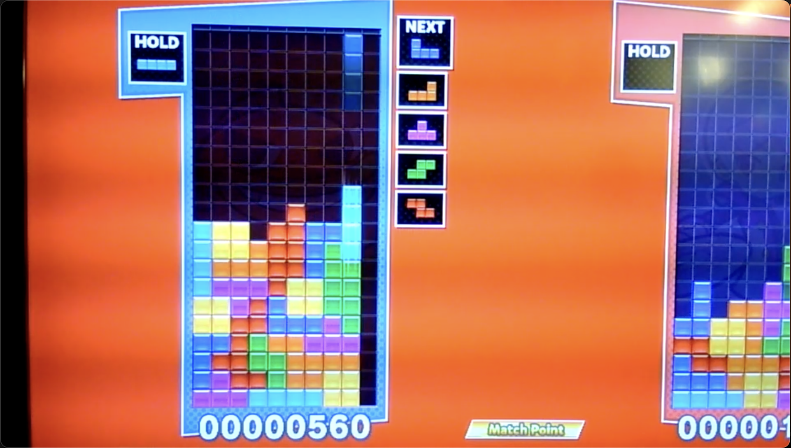
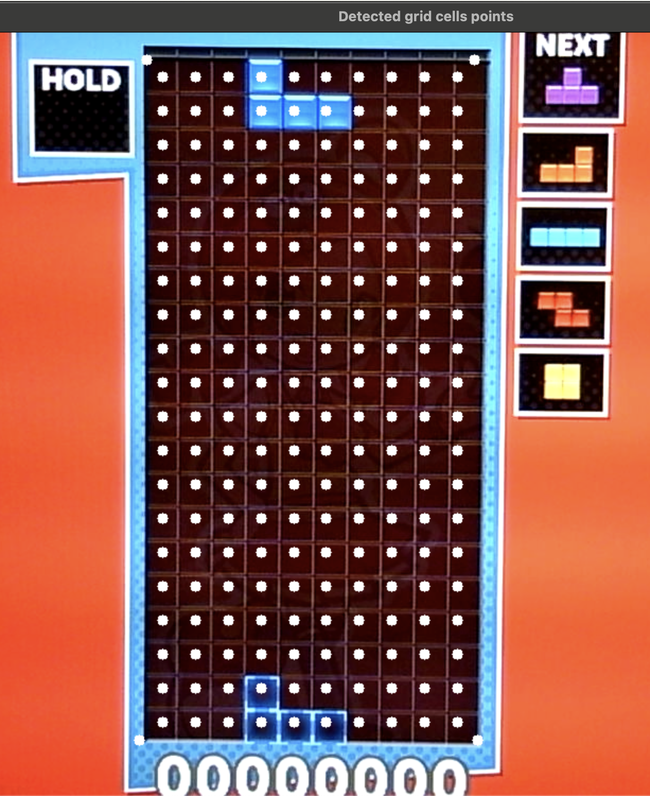
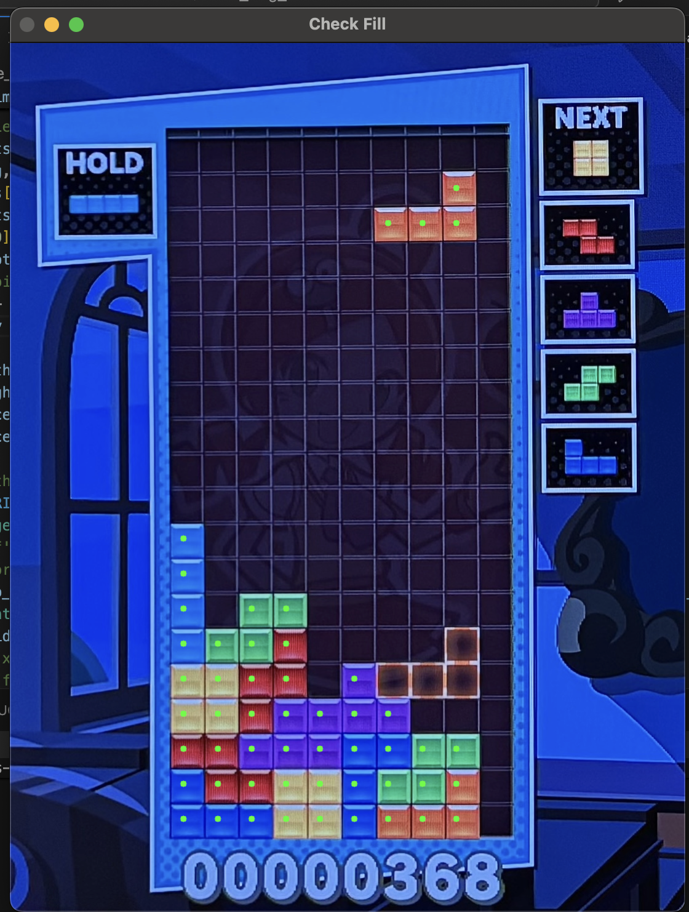
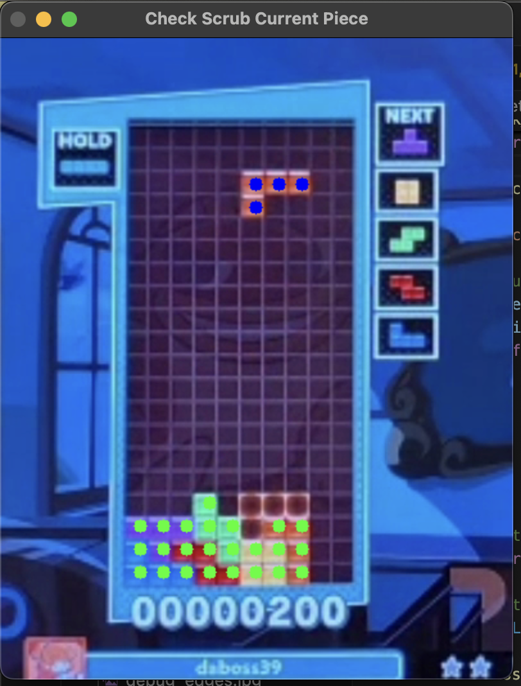
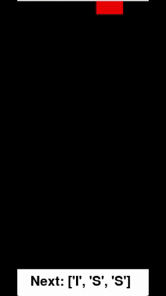
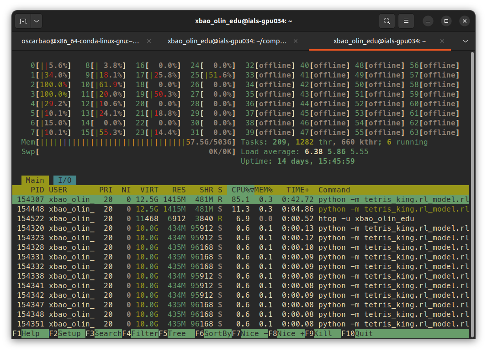
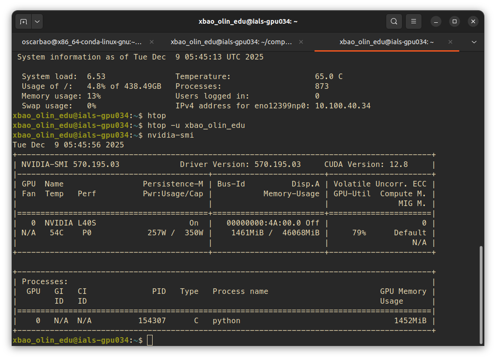

# Milestone 2 Progress Update

## 1. Computer Vision:

By this milestone, the goal for computer vision was to be able to essentially process what's going on in Tetris, which translates to being able to read in live camera frames and output information about the game state (how many game cells are filled + what the current piece is). Overall, we were able to accomplish this goal! We worked up from smaller tasks, testing with sample still images and then videos, and, at this point, we are refining our outputs in our actual real-time playing environment.

One major design decision we made from last milestone was to cut out the first step of screen detection, in order to reduce unneeded complexity with our image input. Instead, we position our webcam to largely only take in the player area we want to control, such as in Figure 1.

  
   
  <em>Figure 1: Input Frame for CV</em>

With this decision in mind, we were able to make significant progress, accomplishing the following tasks for our computer vision pipeline to run in sequence:
- Grid detection (*grid_detection.py*)
- Fill detection of cells (*game_state_detection.py*)
- Current piece detection (*game_state_detection.py*)

Our grid detection takes in a frame of the camera feed, and detects the gameplay grid of the Tetris blocks, outputting the four coordinates points of the grid corners. 

These four coordinate points are then used by the fill detection in order to calculate the center of each grid cell for later color mapping. We calculate the width and height of the gameplay grid using the detected four coordinate points, using the known dimensions of the gameplay grid in cells (10 by 20 cells always) to divide the width and height in cells counts, and applying an offset of half the length in each direction to find the center of the grid. 

  
   
  <em>Figure 2: Our detected grid corner points with center cell points</em>

From these center coordinates, we determinate by using a HSV color map for each tetris piece to check whether a cell is filled, by checking the HSV pixel for being within distance of a certain threshold of any HSV value of a tetris piece. If the cell center pixel passes this threshold, we consider it "filled", and otherwise empty. These get recorded in an output of a 2D array representing the game grid in 0 and 1s. If a cell is 0, then it is empty, and if it is 1, then the cell is detected as filled. 

  
   
  <em>Figure 3: Filled cells detected in green dots</em>

Since we don't want our current falling piece to be considered as part of the "filled" section of the game state, we also exclude the current piece from this fill detection by using a breadth-first search algorithm to determine whether there is an "island" of detected filled pieces that isn't connected to the bottom of the grid, and excluding it. Figure 4 shows the detected pieces to scrub from its consideration of a "filled" game state:

  
   
  <em>Figure 4: The detected pieces dotted in blue to scrub from its consideration of a "filled" game state</em>

The current piece detection is accomplished by checking the upper two rows of the gameplay board for a piece using a similar color detection to the fill detection, as we know a piece always spawns in the same place.

To integrate smoothly with the other components of the project, we wrapped these processes into two functions that the overall pipeline for the project uses, from *cv_pipeline.py*: 
- `initialize_video_capture() `
- `get_cv_info()`

The function `initialize_video_capture()` initializes the webcam video capture using OpenCV's built in `VideoCapture()` function, and runs once at our program start. From there, `get_cv_info()` is called at the beginning of every program loop, in order update the game state and current piece.

While we have made a lot of progress, we have some remaining tuning and testing to do in order to make our computer vision more reliable and efficient. Most of this centers around the imperfect playing environment that we've begun to discover with more testing, with, among other quirks, a webcam that initializes on some computers to a black screen, slight grid warping from an imperfect camera placement, and heavy saturation on some tetris pieces from our webcam looking at a TV screen.

Goals for end of project:
- increase consistency of grid detection corner points
- improve consistency of fill detection against various webcam saturations and glares
- fine tune current piece detection for advanced cases of gameplay (when the filled pieces reach the top)
- consider processing optimizations with initializing grid only once, and potential C++ implementation

## 2. Tetris Emulator:

Our tetris emulator works! At this point, we’ve created three different versions of our tetris class: a playable emulator, which was mainly for debugging the original game, a model that uses our custom heuristic as a basic standard, and a model that interfaces as an RL training environment with a custom step function. 

Here is a visualization of the tetris heuristic max:   

  

First, let’s explore how our main tetris class works: 

The original tetris functions by manipulating a 10x20 matrix that begins as zeros. There is a border surrounding this matrix, and we use a simple detect collision function each time we move our piece on the board. If the piece collides with a side, then we simply stop its movement. When a piece hits the bottom, we mark that it’s reached its final position, update the board to have ones instead of zeros where the piece was, and then spawn our next piece. (Actually, before we spawn our next piece, we check if we need to clear lines or if we have lost). With all of that implemented, and the fact that our new piece can now collide into our placed pieces, we can play tetris. 

Next, each of our different versions of tetris controls the movement/manipulation of pieces in different ways.
For the original model, we simply record keyboard input and move the piece left, right, or rotate the piece based on what the user inputs.
For our heuristic model, we’ve created a function that can score a board based on four factors: bumpiness, height, holes, and lines cleared. With each piece we place, we calculate every possible move for that piece and then place it in the position where we score the highest. 
Lastly, our RL model has a custom step function that takes in an action and returns the ‘next_state’, ‘reward’, ‘win_variable’, ‘iteration’, and ‘valid_moves’. Additionally, we implemented a simple reset function.  

Largely, the work for this section is completed. While there is slightly more work to be done as we move towards integrating the final model, the simulator itself is finalized. 

## 3. Reinforcement Learning:

We've proven the concept for RL! Through the support of MGHPCC, we've successfully trained an RL model that is capable of learning *something*. Specifically, for an agent that places the blocks randomly, the average score per 100 games is close to 0. With our model, we were able to achieve a total of ~200 lines cleared per 100 games, a non insignificant improvement compared to random reference samples. 

  
  
   
  <em>The remote machine hard at work...</em>

In particular, we devised a **Dueling Deep Q Learning** model, where a convolutional neural network takes in the game board as an image and processes it, while a separate network takes in a vector encoding the information about pieces. We then stitch the network together to combine the information, and output to two different networks---one evaluating the state of the board, and the other one evaluating the value of each potential action. We calculate the Q score for each action based on the state of the board and the projected reward for each action. 

For the upcoming week, we will be focused on improving the performance of the model. We have a few leads: 
- Setting our future reward discount factor to 0 and see if the network can approximate an instantaneous reward function
- Do an automatic hyperparameter sweep
- Adjusting our heuristic function so that it's easier to "warm up" the model
- Potentially doing changes to the network architecture, albeit unlikely

## 4. Robotic Arm Controls:

For this milestone, the objective is to optimize the arm speed to enable for realtime interfacing with a physical switch controller. Before the milestone, the average time for the arm to press a button and move back to the "home" position was 3s. Now, that time has decreased to 1.5s. We are still looking to decrease it even further if possible.

Here are the specific tasks achieved in this milestone:
- Physical setup with arm and controller, currently being held in place by wall putty.
- Integrating arm ROS node with `/action` topic which publishes list: `[rotations, moves left/right]`. Arm node receives data and performs required movement to press buttons on the controller
- Implement threading to increase task speed. Works 90% of the time. However, at times, the arm will duplicate one task, most likely a concurrency problem.

Goals til end of project:
- Fix concurrency problem
- Figure out how to connect ROS2 from raspberry pi with ROS2 from laptop that is connected to camera.

Demo video: https://youtube.com/shorts/2U45naUxKbg

## 5. Testing, Integration, & Other:

We are very close to being fully integrated. Each component has a functional MVP, however, while we have a pipeline written, more issues are getting discovered as we try to integrate the parts together, such as the format for passing information, the uncontrolled environment that caused unforeseen challenges to the CV algorithm, among other things. Being fully integrated is top on our priority list, and we believe we are close.
