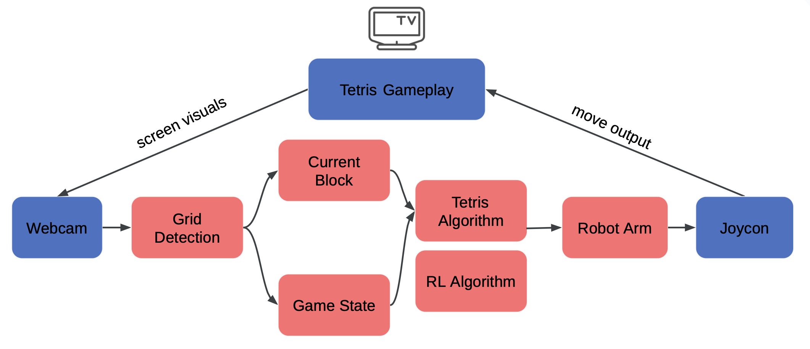
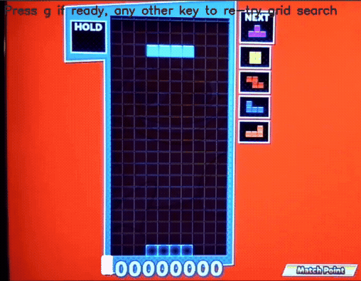
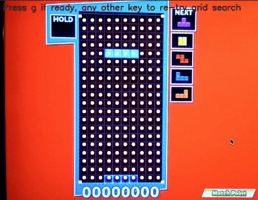

## System Architecture 

Our system runs a superloop of three main components in this order: computer vision, a custom tetris emulator and algorithm, and a robot arm.
<p align="center">
  
  <br>
  <em>Figure 1: System Pipeline</em>
</p>

##Computer Vision

The computer vision pipeline runs in this sequence:
- Grid detection (*grid_detection.py*)
- Fill detection of cells (*game_state_detection.py*)
- Current piece detection (*game_state_detection.py*)

Our grid detection takes in a frame of the camera feed, and detects the gameplay grid of the Tetris blocks, outputting the four coordinates points of the grid corners. 

These four coordinate points are then used by the fill detection in order to calculate the center of each grid cell for later color mapping. We calculate the width and height of the gameplay grid using the detected four coordinate points, using the known dimensions of the gameplay grid in cells (10 by 20 cells always) to divide the width and height in cells counts, and applying an offset of half the length in each direction to find the center of the grid. 

<p align="center">
  
  <br>
  <em>Figure 2: Our detected grid corner points with center cell points</em>
</p>

From these center coordinates, we determinate by using a HSV color map for each tetris piece to check whether a cell is filled, by checking the HSV pixel for being within distance of a certain threshold of any HSV value of a tetris piece. If the cell center pixel passes this threshold, we consider it "filled", and otherwise empty. These get recorded in an output of a 2D array representing the game grid in 0 and 1s. If a cell is 0, then it is empty, and if it is 1, then the cell is detected as filled. 

<p align="center">
  
  <br>
  <em>Figure 3: Filled cells detected in green dots</em>
</p>

Since we don't want our current falling piece to be considered as part of the "filled" section of the game state, we also exclude the current piece from this fill detection by using a breadth-first search algorithm to determine whether there is an "island" of detected filled pieces that isn't connected to the bottom of the grid, and excluding it. Figure 4 shows the detected pieces to scrub from its consideration of a "filled" game state:

<p align="center">
  
  <br>
  <em>Figure 4: The detected pieces dotted in blue to scrub from its consideration of a "filled" game state</em>
</p>

The current piece detection is accomplished by checking the upper three rows of the gameplay board for a piece using a similar color detection to the fill detection, as we know a piece always spawns in the same place.

To integrate smoothly with the other components of the project, we wrapped these processes into two functions that the overall pipeline for the project uses, from *cv_pipeline.py*: 
- `initialize_video_capture() `
- `initialize_grid()`
- `get_cv_info()`

The function `initialize_video_capture()` initializes the webcam video capture using OpenCV's built in `VideoCapture()` function, and runs once at our program start. `initialize_grid()` intitializes the grid corner points and the center of the game cells' coordinates, allowing users to look at the detection visually and re-try until the grid is locked on accurately. This can be seen below:

<p align="center">
  
  <br>
  <em>Figure 5: Grid Initialization Process</em>
</p>

From there, `get_cv_info()` is called at the beginning of every program loop, in order update the game state and current piece. These repeated loops and CV game state detction can be seen below, with testing on a recorded video of gameplay.

<p align="center">
  
  <br>
  <em>Figure 6: Game state detection loop, with yellow dots indicating detected filled cells and blue dots representing filled cells to scrub out</em>
</p>


## Tetris Simulator 

Across our project, we’ve created three different versions of our tetris class: a playable emulator, which was mainly for debugging the original game, a model that uses our custom heuristic as a basic standard, and a model that interfaces as an RL training environment with a custom step function. 

Here is a visualization of the tetris heuristic max:   

<p align="center">
  
</p>

First, let’s explore how our main tetris class works: 

The original tetris functions by manipulating a 10x20 matrix that begins as zeros. There is a border surrounding this matrix, and we use a simple detect collision function each time we move our piece on the board. If the piece collides with a side, then we simply stop its movement. When a piece hits the bottom, we mark that it’s reached its final position, update the board to have ones instead of zeros where the piece was, and then spawn our next piece. (Actually, before we spawn our next piece, we check if we need to clear lines or if we have lost). With all of that implemented, and the fact that our new piece can now collide into our placed pieces, we can play tetris. 

Next, each of our different versions of tetris controls the movement/manipulation of pieces in different ways.
For the original model, we simply record keyboard input and move the piece left, right, or rotate the piece based on what the user inputs.
For our heuristic model, we’ve created a function that can score a board based on four factors: bumpiness, height, holes, and lines cleared. With each piece we place, we calculate every possible move for that piece and then place it in the position where we score the highest. 
Lastly, our RL model has a custom step function that takes in an action and returns the ‘next_state’, ‘reward’, ‘win_variable’, ‘iteration’, and ‘valid_moves’. Additionally, we implemented a simple reset function.  

In integration, we can use the heuristic model with either our original hueristic or an RL algorithm. 

## Arm

In this project, the robotic arm is the physical component that connects the computer vision pipeline with the switch controller. It receives two pieces of information, number of rotations and number/direction of movement, and acts on them accordingly. Throughout the project, the two area of focus for the arm are its accuracy and its speed, as they both need to be satisfied to perform adequately in the realtime constraints that we have imposed.

#### Forward Kinematics
Forward Kinematics is an essential part of any project that involves a robotic arm. It is required for determining where the robotic arm is in 3D space. And later on, we will see that it is pivotal for inverse kinematics as well.
The approach we have chosen is the power of exponential, where the key components to watch out for are the matrix M and the vectors S. The matrix M is the transformation from the fixed origin frame to the end-effector frame when all angles are at zero. The vectors S are screw axis that express the change in location and position of the end effector when one radian of rotation is applied to a certain joint. Hence, S_1 is the screw axis describing how changes in joint 1's angle will affect the end effector. The screw axes always has two components, the rotation component and a linear component.

By taking the exponential of a screw S multiplied with its corresponding angle theta, it will result in the transformation matrix that explains how a rotation of theta in that joint has affected the end effector. Using this logic, we premultiply the transformations of each joint to the end-effector to get a resulting transformation. However, the order of multiplications of each joint matters. Because we are premultiplying, the most right transformation is applied first, and applying one by one each one to the left. Each transformation is applied in the perspective of the fixed origin frame, and therefore, we would want to apply the last joint first. Imagine the arm is in its original position. If the transformation is applied the last joint, then all other joints before it are unaffected by other transformations. Then we apply the transformation to the second last joint, all other joints other than the first two are unaffected by the transformation. By this logic, we can see the intuition of why the transformations are applied in the way they are. 

#### Numerical Inverse Kinematics
Inverse Kinematics allows us to take a desired end effector position and calculate for angles to pass to the arm. The approach we have chosen is the numerical approach where we pose an initial guess (current angles) and take educated guesses until we reach an end effector position that has error lower than a selected threshold. The first step is to calculate the error between the current position and end effector position. To do this, we must utilize the forward kinematics we have outlined in the section above, returning to us the current position. We then check whether this error is lower than our selected threshold. Next, we find the Jacobian of our system based on the current angle guess. The Jacobian is a matrix that describes the relationship between the change in angles with the change in linear speed of the end effector.    
```x_dot = J * theta_dot```

The Jacobian were calculated by an opensource robotics library "modern robotics." X_dot represents the linear velocity, but we can also reinterpret it as the desired change in x from our current position. Conveniently, the error we have calculated tells us exactly that, how much we must move and in what direction. Hence, we can rewrite the equation as follows.    
```error = J * theta_dot```

By applying the inverse Jacobian, we get the following equation that transforms the error into a change in theta that can guide our next guess.   
```J^-1 * error = J^-1 * J * theta_dot```  
```J^-1 * error = theta_dot```  


However, there is a very common problem with the current equation, the inverse Jacobian might not be invertible. In the real world, this usually means the robot is nearing or at a singularity, a configuration of joints where the arm loses one of its degree of freedom. To solve this problem, we will replace the inverse Jacobian with the damped pseudo-inverse Jacobian. This ensures that we will almost always be able to solve for the inverse Jacobian. In addition, there is also the damping factor. The damping becomes bigger the closer the inverse Jacobian is to a singularity and smaller when the inverse Jacobian in a normal state. It ensures that the inverse kinematics will still make progress when the guess is at an undesirable location.
```J+ * error = theta_dot```
```theta_i+1 = theta_i + theta_dot```
We iterate the above two steps until we reach the desired end effector position.  

#### Threading to Increase Speed
While working with the provided library for the specific robot arm, we observed that the arm would pause 0.5 to 1s once its reached a desired location. This is problematic because it wasted time, approximately two seconds per action pair (press a button and return back home). When implemented normally, the arm takes ~3.5s for every sequence. Our solution was to implement two threads, one where the arm is given the directive to press the button, and the other stops the first thread and directs the arm to return to the home position. Although unothordox, the solution achieved the solution that we wanted, reducing the time of each sequence down to 1.5 seconds, just barely fast enough for our realtime constraints. However, this solution has drawbacks as it causes the robot to hallucinate once in awhile, resulting in more presses than directed. Furthermore, we had no control over the timing of how long the arm would stay in its position. In the future, we hope to reach out to the implementor of the library and discuss how we can bypass this problem.  

#### Connection Through Ethernet   
Another problem we faced were the compute power of the Raspi 3 Model B. We first discovered this problem when running the numerical IK on it. When ran on the laptop, the numerical IK took 0.02 to 0.05 seconds. However on the Raspi, it took 0.3 seconds. It was so much slower, we had to calculate the IK before hand and input manual angle solutions to the Raspi. Therefore, a setup where the arm, a camera, and the whole pipeline running the Raspi 3 Model B was out of the question. 
  
Instead, we decided to have the camera and CV pipeline on a seperate laptop and connect to the Raspi
using an ethernet cable. After we have established wired connection between the two machines, we
setup a TCP socket between them. The client (laptop) would send a list of two numbers through the
socket. And the server (raspi) would respond once an action is finished. By doing this, we were able to
divert the compute load to the laptop and have the Raspi mainly focus on moving the arm. With
hindsight, it would've been possible to run IK on the laptop and also send that information over the
socket as well. Although, it still doesn't make that much sense if all the desired poses are hard coded
anyway.

## Full Pipeline
The main control script runs a continuous superloop that connects computer vision, the Tetris simulator, decision-making, and the robotic arm. At startup, the program establishes a TCP socket connection to a Raspberry Pi that controls the arm, initializes the webcam, detects the Tetris grid, and creates an internal Tetris simulator to track the board state. This setup allows the system to offload computation to a laptop while keeping the robot focused on physical actuation.

During each iteration of the loop, the computer vision pipeline detects the current game board and the falling piece from the camera feed. To improve reliability, the detected piece is buffered across multiple frames before being accepted. Once a stable detection is achieved, the camera-derived board state is compared against the internal Tetris board. If a mismatch is found, the internal board is overwritten to ensure the simulator remains synchronized with the real game.

With the game state aligned, the simulator evaluates all possible placements for the current piece using a heuristic-based algorithm and selects the best move in terms of rotations and horizontal translations. This move is applied internally and then sent over the network to the Raspberry Pi, which commands the robotic arm to press the corresponding buttons on the controller. The loop then repeats, enabling fully autonomous, real-time gameplay.

## Design Decisions

**Computer Vision**

One major design decision we made early on was to cut out the first step of screen detection, in order to reduce unneeded complexity with our image input. Instead, we position our webcam to largely only take in the player area we want to control.

<p align="center">
  
  <br>
  <em>Input Frame for CV</em>
</p>

